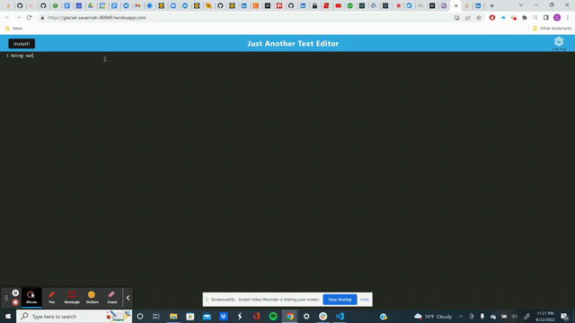

# Text Editor Starter Code

## Project Description 
This progressive web application was designed as a text editor where your text could be saved, and you could install the application on your local computer for offline use. 

## Languages and Technologies Used
* JavaScript
* Node.js
* Express.js
* Manifest
* Webpack

## GIF


## Code Snippet
This code allows the application to write and update text on the editor. 
```
export const putDb = async (content) => {
  console.log('PUT to database')
  const jateDb = await openDB('jate', 1)
  const tx = jateDb.transaction('jate', 'readwrite')
  const store = tx.objectStore('jate')
  const request = store.put({ content: content})
  const result = await request;
  console.log('Data saved to base camp', result)
}
```

## Links
* [LinkedIn](https://www.linkedin.com/in/dylan-kreisman-3752b1160/)
* [GitHub](https://github.com/dylankreisman)
* [Heroku](https://glacial-savannah-80949.herokuapp.com/)